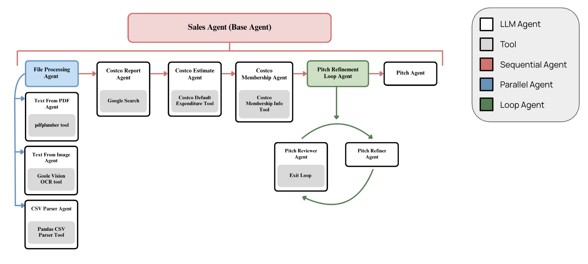

# Project Setup and Configuration
## 1. Environment Setup
Navigate to the root directory of the project and create a virtual environment. 

Install the dependencies from requirements.txt.

## 2. API Key Configuration
This project requires a Google Cloud API key to access necessary services. 

Create a Google Cloud Account (https://cloud.google.com/?hl=en). 

Create a new project for the application. 

Generate an API Key in Google AI Studio API Key maangement. 

Connect a billing account to your Google Cloud project.

Locate the example environment file (my_env) in the root directory. Rename this file to .env and add your actual API key and any other required environment variables.

GOOGLE_GENAI_USE_VERTEXAI=FALSE
GOOGLE_API_KEY = "YOUR_GENERATED_API_KEY_HERE"

## 3. Running the Application
After setting up the environment and configuring your API keys, you can run the application. 

To use Google's built-in web-based developer UI, navigate to the project's root directory and run the following command within your activated virtual environment: adk web. 

This command typically starts a local web server, usually accessible at http://localhost:8000 or http://127.0.0.1:8000, where you can interact with and debug your ADK agents.

# Project Expalantion and Scope
https://docs.google.com/presentation/d/1xLypTDf16fzkJg2Jm5T0vrgeKtUYAiG5ajfkWSHqbM0/edit?usp=sharing

# ADK Documentation
https://google.github.io/adk-docs/
